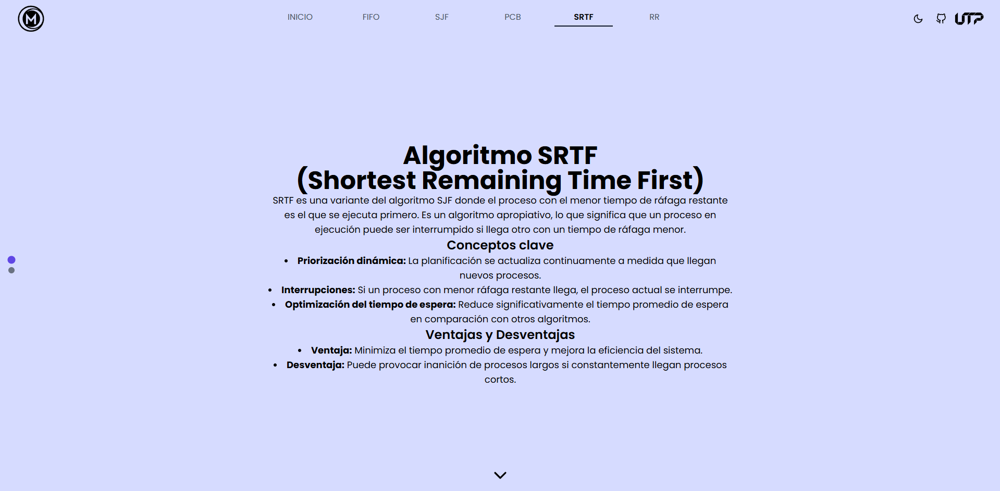

# Simulador de Algoritmos de Despacho

Este es un proyecto desarrollado en **Next.js 15.2.0**, con **TypeScript** y **TailwindCSS 4**, que permite la simulación visual de varios algoritmos de planificación de procesos en sistemas operativos.

## 📌 Características

- Simulación de los algoritmos de despacho:
  - **FIFO (First In, First Out)**
  - **SJF (Shortest Job First)**
  - **PCB (Process Control Block)**
  - **SRTF (Shortest Remaining Time First)**
  - **RR (Round Robin)**
- Pantalla de inicio con un botón para acceder a la simulación de **FIFO**.
- Navegación entre los algoritmos a través de un contenedor vertical tipo **slide**.
- Modos **claro y oscuro**.

## 🚀 Instalación y Ejecución

Sigue estos pasos para ejecutar el proyecto localmente:

### 1️⃣ Clonar el repositorio

```bash
 git clone https://github.com/NotMarin/dispacth-algorithms
 cd dispacth-algorithms
```

### 2️⃣ Instalar dependencias

```bash
 npm install
 # o si usas yarn:
 yarn install
```

### 3️⃣ Ejecutar el servidor de desarrollo

```bash
 npm run dev
 # o con yarn:
 yarn dev
```

El servidor se iniciará en `http://localhost:3000/` por defecto.

## 🛠️ Tecnologías Usadas

- **Next.js 15.2.0** - Framework para React con SSR y optimización automática.
- **TypeScript** - Tipado estático para mayor seguridad en el código.
- **TailwindCSS 4** - Framework de estilos para un diseño rápido y eficiente.

## 📷 Capturas de Pantalla




